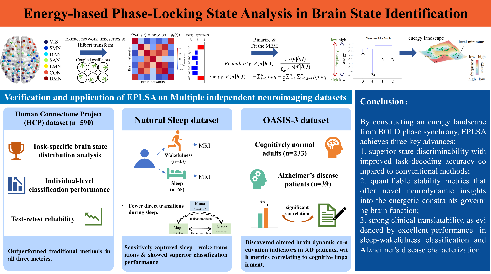

# Energy-based Phase-Locking State Analysis (EPLSA) for Brain State Identification

## Overview
This repository contains the implementation code for the research presented in the paper "Energy-based Phase-Locking State Analysis in Brain State Identification". The study addresses limitations in conventional brain energy landscape analysis (ELA) by introducing a novel computational framework—Energy-based Phase-Locking State Analysis (EPLSA)—that synergistically integrates instantaneous phase-coupling dynamics with rigorous energy landscape principles. This approach enables enhanced quantification of brain state stability and transitions, offering insights into neurodynamic mechanisms across cognitive tasks, consciousness states, and neurodegenerative conditions such as Alzheimer’s diseas.

EPLSA demonstrates marked superiority over existing methods like Leading Eigenvector Dynamic Analysis (LEiDA) and amplitude-based ELA in terms of test-retest reliability, task-specific brain state differentiation, and individual-level classification performance. Validation across three independent neuroimaging datasets highlights its sensitivity to consciousness transitions (e.g., sleep-wake cycles) and pathological changes in Alzheimer’s disease, revealing altered state occupancy and transition probabilities correlated with cognitive impairment.

## Key Features
- Phase-Locking Integration: Unifies phase synchronization dynamics with thermodynamic formalism for robust stability quantification.
- ​Multistate Brain Analysis: Identifies and characterizes brain states using energy-based principles, improving sensitivity to transitions and individual differences.
- Cross-Condition Validation: Evaluated on cognitive tasks, sleep-wake states, and neurodegenerative data, showing consistent performance gains.
- ​Clinical Relevance: Detects state-specific anomalies in Alzheimer’s disease (e.g., dwell time changes in FPCN-DMN and VIS-LMN co-activation states) correlated with cognitive metrics.

## Script Functionality Details

### Dataprocessing_Dynamic_Analysis.ipynb
This script serves as the foundational data processing and dynamic characterization pipeline for fMRI time series data.   Its key functionalities include:
- Generating standardized input data matrices for four distinct neurodynamic analysis frameworks: Leading Eigenvector Dynamic Analysis (LEiDA) in both ROI-wise (LEiDA-ROI) and network-wise (LEiDA-NET) modes, Energy Landscape Analysis (ELA), and the proposed Energy-based Phase-Locking State Analysis (EPLSA).
- Implementing computational workflows for brain dynamic quantification, including the extraction of dynamic metrics such as state occupancy, transition probability and dwell time.
- Conducting group-level statistical analysis to assess between-group differences in the computed dynamic metrics, with correction for multiple comparisons.

### KL_MNR.ipynb & Classification_capability.ipynb
The two scripts focus on quantitative performance evaluation of neurodynamic state identification methods using the Human Connectome Project (HCP) dataset.   It implements calculations for three critical evaluation metrics:
- Kullback-Leibler (KL) divergence
- Mean Nearest Rank (MNR)
- Classification capability(accuracy (ACC), precision, recall, and F1-score)

### Apply_Dataset.ipynb
This script demonstrates the application of all four methods to the Natural Sleep dataset, focused on sleep-wake state identification and method comparison.

### OASIS3.ipynb
This script integrates OASIS3 dataset participant selection (based on amyloid thresholds) and correlation analysis between EPLSA-derived brain dynamic metrics and cognitive scale data.
